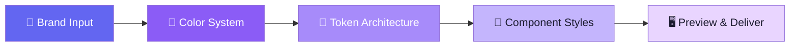

<div align="center">

# 🎨 Design System Generator

**One color in → Full design system out**

An AI agent skill that generates a complete, production-ready design system from a single brand color.
Works with **Antigravity** · **Claude Code** · **Cursor** · **Codex** · **Trae** and any agent supporting the Agent Skills standard.

[](LICENSE)
[](https://agentskills.io)
[](CONTRIBUTING.md)

[English](README.md) · [中文](README_CN.md)

</div>

---

## ✨ Features

| Feature | Description |
|---------|-------------|
| 🎯 **One Color Input** | Just provide a hex color — everything else is derived algorithmically |
| 🌈 **OKLCH Color System** | Perceptually uniform palettes with 10-step scales + semantic colors |
| 📐 **W3C Design Tokens** | Output follows the W3C Design Tokens spec (`$value`/`$type` format) |
| 🌗 **Light & Dark Themes** | Automatic dual-theme support via `light-dark()` + `[data-theme]` |
| 🧩 **11 Components** | Button, Card, Input, Badge, Alert, Avatar, Skeleton, Tooltip, Modal, Navbar, Divider |
| ♿ **WCAG 2.2 AA** | All color combinations validated for accessibility contrast ratios |
| 🖥️ **Live Preview** | Self-contained HTML page to visualize your entire design system |
| 🔌 **Multi-Agent** | Works with Antigravity, Claude Code, Cursor, Codex, Trae, and more |
| 0️⃣ **Zero Dependencies** | Pure CSS custom properties — no preprocessors, no frameworks |

---

## 🚀 Quick Start

### 1. Install

<details>
<summary><b>Antigravity / Gemini CLI</b></summary>

Copy this repository to your plugins directory:

```bash
# Clone
git clone https://github.com/XINGANLIU/design-system-generator-skill.git

# Move to plugins
cp -r design-system-generator-skill ~/.gemini/config/plugins/design-system-generator
```

</details>

<details>
<summary><b>Claude Code</b></summary>

Clone into your project, then use the `/design-system` command:

```bash
git clone https://github.com/XINGANLIU/design-system-generator-skill.git .design-system-generator
```

The `.claude/commands/design-system.md` file enables the `/design-system` slash command.

</details>

<details>
<summary><b>Cursor</b></summary>

Clone into your project root. The `.cursorrules` file is automatically detected:

```bash
git clone https://github.com/XINGANLIU/design-system-generator-skill.git .
```

</details>

<details>
<summary><b>Codex / Other Agents</b></summary>

Clone and reference the `AGENTS.md` file or `skills/design-system-generator/SKILL.md`:

```bash
git clone https://github.com/XINGANLIU/design-system-generator-skill.git
```

</details>

### 2. Use

Just ask your AI agent:

```
Generate a design system with brand color #6366f1
```

Or be more specific:

```
Create a design system using coral (#f97316) with Outfit font and pill-shaped buttons
```

### 3. Get Your Design System

The agent will generate these files in your project:

```
design-system/
├── tokens.json       # W3C Design Tokens (machine-readable)
├── tokens.css        # CSS Custom Properties (import this!)
├── components.css    # Ready-to-use component styles
└── preview.html      # Open in browser to preview
```

### 4. Use in Your Project

```html
<head>
  <link rel="stylesheet" href="design-system/tokens.css">
  <link rel="stylesheet" href="design-system/components.css">
</head>
<body>
  <button class="btn btn--primary">Get Started</button>
</body>
```

---

## 🏗️ How It Works

The skill follows a structured 5-phase workflow:



| Phase | What Happens |
|-------|-------------|
| **1. Brand Input** | Collect brand color, font, border-radius style, density preference |
| **2. Color System** | Generate OKLCH palettes: primary (10 steps), neutral (10 steps), semantic (4 colors × 5 variants) |
| **3. Token Architecture** | Output W3C Design Tokens JSON + CSS custom properties with light/dark semantic mappings |
| **4. Component Styles** | Generate 11 components with variants, states, hover/focus animations, accessibility |
| **5. Preview & Deliver** | Create a visual preview HTML page with theme toggle |

---

## 📁 Project Structure

```
design-system-generator/
├── plugin.json                              # Antigravity plugin metadata
├── .cursorrules                             # Cursor adapter
├── AGENTS.md                                # Codex adapter
├── .claude/commands/design-system.md        # Claude Code adapter
├── .trae/rules/design-system.md             # Trae adapter
├── skills/
│   └── design-system-generator/
│       ├── SKILL.md                         # 🧠 Core instructions
│       ├── references/
│       │   ├── color-system.md              # OKLCH algorithm
│       │   ├── typography-scale.md          # Font scales
│       │   ├── spacing-system.md            # Spacing & layout
│       │   ├── component-patterns.md        # Component CSS patterns
│       │   └── dark-mode-guide.md           # Theme implementation
│       └── templates/
│           ├── tokens.json.tmpl             # Token template
│           ├── tokens.css.tmpl              # CSS template
│           ├── components.css.tmpl          # Component template
│           └── preview.html.tmpl            # Preview template
├── examples/
│   ├── ocean-blue/                          # Example: #3b82f6
│   └── sunset-coral/                        # Example: #f97316
├── README.md
├── README_CN.md
└── LICENSE
```

---

## 🎨 Examples

### Ocean Blue (`#3b82f6`)

<details>
<summary>Preview the generated color palette</summary>

The Ocean Blue theme uses OKLCH hue 265° to generate a cool, professional palette:

| Step | Value | Usage |
|------|-------|-------|
| 50 | `oklch(97% 0.022 265)` | Subtle background |
| 500 | `oklch(62% 0.220 265)` | Brand color |
| 950 | `oklch(18% 0.088 265)` | Near-black tinted |

Open `examples/ocean-blue/preview.html` in your browser to see the full design system.

</details>

### Sunset Coral (`#f97316`)

<details>
<summary>Preview the generated color palette</summary>

The Sunset Coral theme uses OKLCH hue 55° for a warm, vibrant palette:

| Step | Value | Usage |
|------|-------|-------|
| 50 | `oklch(97% 0.020 55)` | Subtle background |
| 500 | `oklch(72% 0.200 55)` | Brand color |
| 950 | `oklch(22% 0.080 55)` | Near-black tinted |

Open `examples/sunset-coral/preview.html` in your browser to see the full design system.

</details>

---

## 🧩 Generated Components

All components are production-ready with:
- ✅ Multiple variants and sizes
- ✅ Hover, focus, active, and disabled states
- ✅ Micro-animations and transitions
- ✅ Keyboard accessibility (`focus-visible`)
- ✅ Automatic Light/Dark theme support
- ✅ Zero hardcoded values — 100% token-based

| Component | Variants | Interactive States |
|-----------|----------|-------------------|
| `.btn` | primary, secondary, ghost, danger + sizes | hover, focus, active, disabled |
| `.card` | elevated, outlined, filled | hover lift/border |
| `.input` | default, error, disabled | focus ring, validation |
| `.badge` | primary, success, warning, danger, neutral | — |
| `.alert` | info, success, warning, danger | dismissible |
| `.avatar` | sm, md, lg | — |
| `.skeleton` | text, circle, rect | shimmer animation |
| `.tooltip` | — | hover reveal |
| `.modal` | — | open/close animation |
| `.navbar` | — | sticky, blur backdrop |
| `.divider` | horizontal, vertical | — |

---

## 🔌 Multi-Agent Compatibility

This skill is designed to work across all major AI coding agents:

| Agent | Adapter File | How It Works |
|-------|-------------|-------------|
| **Antigravity** | `plugin.json` + `skills/` | Native plugin — auto-detected |
| **Claude Code** | `.claude/commands/design-system.md` | Use `/design-system` command |
| **Cursor** | `.cursorrules` | Auto-loaded as project rules |
| **Codex** | `AGENTS.md` | Auto-loaded as agent instructions |
| **Trae** | `.trae/rules/design-system.md` | Auto-loaded as project rules |
| **Others** | `skills/.../SKILL.md` | Reference SKILL.md directly |

---

## 🤝 Contributing

Contributions are welcome! You can help by:

- 🎨 Adding new component patterns to `references/component-patterns.md`
- 🌍 Adding new example themes to `examples/`
- 🔧 Improving the OKLCH color generation algorithm
- 📝 Enhancing documentation and translations
- 🐛 Reporting issues or suggesting features

See [CONTRIBUTING.md](.github/CONTRIBUTING.md) for detailed guidelines.

---

## 📄 License

[Apache 2.0](LICENSE) — Created by [XINGANLIU](https://github.com/XINGANLIU)

---

<div align="center">

**One color in → Full design system out** 🎨

If this skill helps you, give it a ⭐ on GitHub!

</div>
